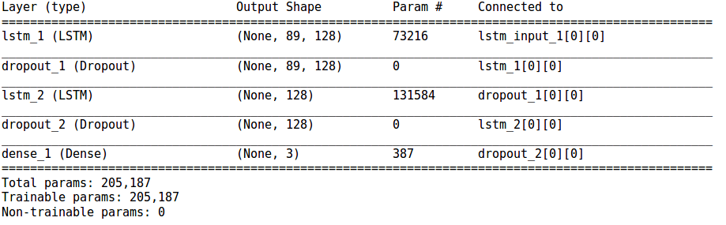
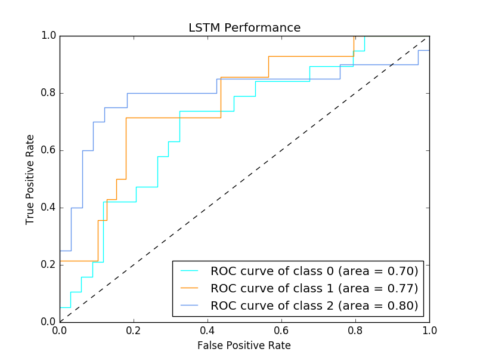
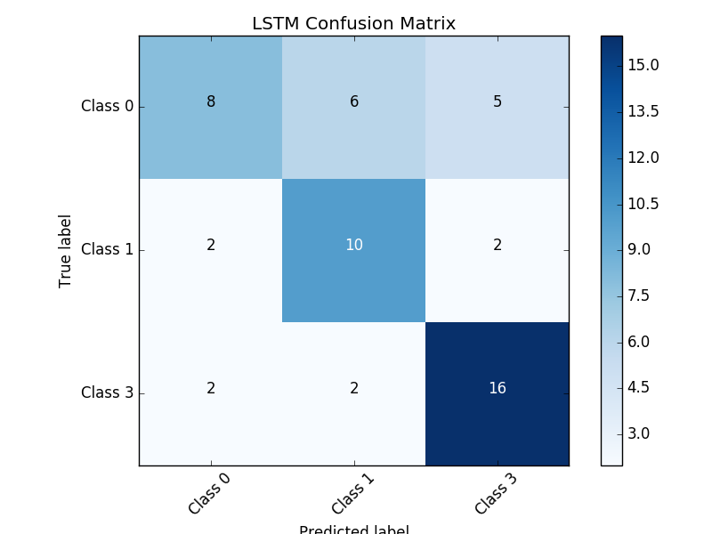
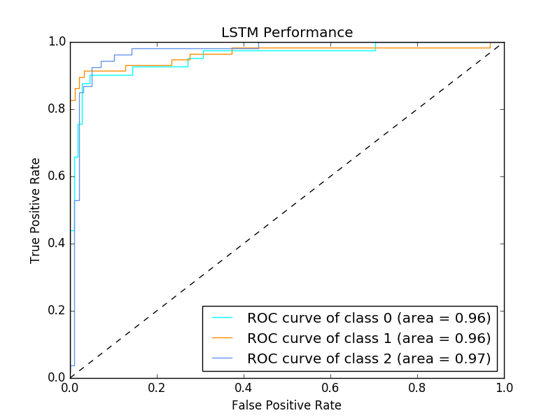
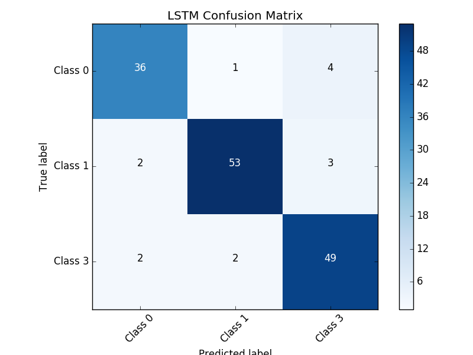

# Multivariate-Classification
Multivariate Time Series  Classification Using LSTM

### Multivariate Time Series Classification using LSTM - Keras 

**How to Run:**  `main.py` and `Multi-variate-Time-series-Data.xlsx` need to be on the same folder. The script will create four images

**dataset Stats:**
`Multi-variate-Time-series-Data.xlsx`
- Total Number of Time Series : 205
- Data For Training :  72%
- Data For Validation : 8%
- Data For Testing : 20%

**Method Overview :** I have used Keras framework and an LSTM Network to design the model
**Train-Test Data Generation**
  `win_size = 89` represents time series size.   `num_var = 14` represents the feature vector size. Based no this I extract `segments`of  `89*14` array. FUrtherr, we feed this time series to LSTM sequntially.

**Model Sumary**
 

 **Parameter setting**
  `split_ratio = 0.8`
`learning rate=0.001`
`nb_epoch=50`
`batch_size=64`

 **Output:**

1. Performance of model on `test set`,

Test ROC             |  Test Confusion matrix
:-------------------------:|:-------------------------:
  |  

2. Performance of model on `train set`,

Train ROC             |  Train Confusion matrix
:-------------------------:|:-------------------------:
  |  

 
